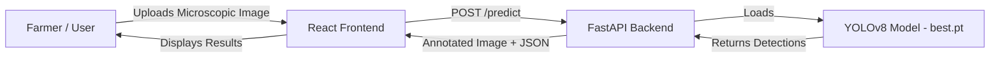
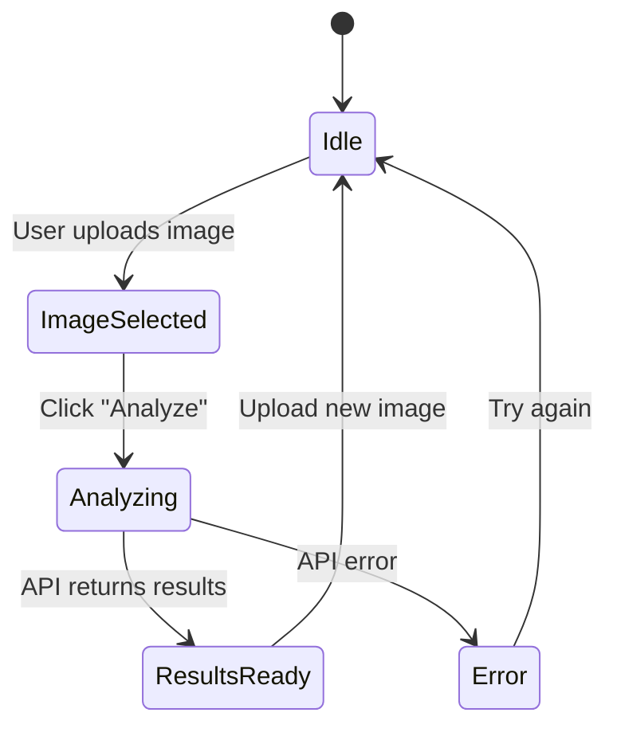

# 🌾 SporeNet — Early Plant Disease Risk Detection System

## Implementation Plan

> [!IMPORTANT]
> This plan covers a full-stack web application that uses a trained YOLOv8 model ([best.pt](file:///c:/Users/nirth/Documents/PROJECTS/sporenet/model/best.pt)) to detect airborne spores from microscopic images, count them, estimate disease risk, and present actionable insights to farmers.

---

## 🧩 System Architecture



## 📁 Project Structure

```
sporenet/
├── backend/
│   ├── main.py                  # FastAPI application entry point
│   ├── config.py                # Configuration constants (thresholds, paths)
│   ├── models/
│   │   └── predictor.py         # YOLO model loading & inference logic
│   ├── routes/
│   │   └── predict.py           # /predict endpoint router
│   ├── utils/
│   │   ├── risk_calculator.py   # Risk level computation with density-based thresholds
│   │   └── image_utils.py       # Image validation, annotation helpers
│   ├── static/
│   │   └── outputs/             # Annotated output images (served statically)
│   └── requirements.txt         # Python dependencies
│
├── frontend/
│   ├── public/
│   │   └── index.html
│   ├── src/
│   │   ├── App.jsx              # Main app component
│   │   ├── App.css              # Global styles
│   │   ├── index.jsx            # Entry point
│   │   ├── index.css            # CSS design system (tokens, utilities)
│   │   ├── components/
│   │   │   ├── Header.jsx       # App header with branding
│   │   │   ├── Header.css
│   │   │   ├── ImageUpload.jsx  # Upload + preview component
│   │   │   ├── ImageUpload.css
│   │   │   ├── ResultsPanel.jsx # Detection results display
│   │   │   ├── ResultsPanel.css
│   │   │   ├── RiskGauge.jsx    # Visual risk level gauge
│   │   │   ├── RiskGauge.css
│   │   │   ├── AnnotatedImage.jsx  # Annotated output viewer
│   │   │   └── AnnotatedImage.css
│   │   └── services/
│   │       └── api.js           # Axios API service
│   ├── package.json
│   └── vite.config.js           # Vite configuration
│
├── model/
│   └── best.pt                  # ✅ Already present (trained YOLOv8 model)
│
└── README.md                    # Project documentation
```

---

## ⚙️ Phase 1: Backend (FastAPI + YOLO)

### Step 1.1 — Configuration (`config.py`)

Define all constants in one place:
- Model path: `../model/best.pt`
- Output directory for annotated images
- Risk thresholds (with density-based calculation)
- Allowed image extensions
- CORS origins

### Step 1.2 — Model Predictor (`models/predictor.py`)

- Load YOLOv8 model once at startup using `ultralytics.YOLO`
- Create a `predict(image_path)` function that:
  1. Runs inference with confidence threshold (e.g., 0.25)
  2. Extracts bounding boxes, class names, and confidence scores
  3. Returns structured detection results

### Step 1.3 — Risk Calculator (`utils/risk_calculator.py`)

> [!TIP]
> The user wants density-based risk calculation, not just raw count thresholds. This accounts for the image's coverable area.

**Density-Based Risk Calculation Logic:**

```python
# Raw count thresholds (baseline for standard microscope field)
# These assume a standard field of view at a fixed magnification

# Method: Calculate spore density per unit area
# 1. Use image dimensions as proxy for field of view
# 2. Calculate density = spore_count / (image_area_in_pixels / reference_area)
# 3. Apply normalized thresholds

# Simplified approach for v1:
def calculate_risk(spore_count: int, image_width: int, image_height: int) -> dict:
    """
    Calculate risk based on spore density.
    
    Reference field: 640x640 pixels (standard YOLO input)
    Density = count * (reference_area / actual_area)  -- normalize to reference
    """
    reference_area = 640 * 640
    actual_area = image_width * image_height
    normalization_factor = reference_area / actual_area
    normalized_count = spore_count * normalization_factor
    
    if normalized_count < 5:
        risk_level = "Low"
        recommendation = "No immediate action needed. Continue regular monitoring."
    elif normalized_count < 20:
        risk_level = "Moderate"  
        recommendation = "Apply preventive fungicide. Increase monitoring frequency."
    else:
        risk_level = "High"
        recommendation = "Immediate fungicide application recommended. Isolate affected area."
    
    return {
        "risk_level": risk_level,
        "normalized_count": round(normalized_count, 1),
        "density_per_field": round(normalized_count, 1),
        "recommendation": recommendation
    }
```

### Step 1.4 — Image Utilities (`utils/image_utils.py`)

- Validate file type (jpg, jpeg, png only)
- Save uploaded file to temp location
- Generate annotated image using YOLO's `plot()` method
- Save annotated image to `static/outputs/`

### Step 1.5 — Predict Endpoint (`routes/predict.py`)

```
POST /predict
Content-Type: multipart/form-data
Body: file (image)

Response:
{
  "spore_type": "Rice Blast (Magnaporthe oryzae)",
  "spore_count": 12,
  "normalized_count": 14.2,
  "risk_level": "Moderate",
  "recommendation": "Apply preventive fungicide. Increase monitoring frequency.",
  "confidence_avg": 0.87,
  "detections": [
    {"class": "spore", "confidence": 0.92, "bbox": [x1, y1, x2, y2]},
    ...
  ],
  "annotated_image_url": "/static/outputs/annotated_<uuid>.jpg"
}
```

### Step 1.6 — Main App (`main.py`)

- FastAPI app initialization
- CORS middleware (allow frontend origin)
- Mount static files directory
- Include predict router
- Load model at startup event

### Step 1.7 — Requirements (`requirements.txt`)

```
fastapi>=0.104.0
uvicorn[standard]>=0.24.0
ultralytics>=8.0.0
opencv-python-headless>=4.8.0
Pillow>=10.0.0
python-multipart>=0.0.6
```

---

## 🎨 Phase 2: Frontend (React + Vite)

### Step 2.1 — Project Setup

- Initialize with Vite + React template
- Install dependencies: `axios`
- Set up project structure

### Step 2.2 — Design System (`index.css`)

**Color Palette:**
- Primary: Deep green (#0B6E4F) — agriculture theme
- Secondary: Warm amber (#F59E0B) — warning/attention
- Accent: Rich teal (#14B8A6)
- Background: Dark (#0F172A) with subtle grain texture
- Surface: Glass-effect cards (#1E293B with opacity)

**Design Elements:**
- Glassmorphism cards with backdrop blur
- Smooth gradient backgrounds
- Micro-animations on interactions
- Google Font: "Inter" for clean readability
- Risk-level color coding:
  - Low: Emerald green (#10B981)
  - Moderate: Amber (#F59E0B)
  - High: Red (#EF4444)

### Step 2.3 — Components

| Component | Purpose |
|-----------|---------|
| `Header` | App branding, logo, tagline "Early Disease Detection for Smarter Farming" |
| `ImageUpload` | Drag-and-drop zone + file picker, image preview, upload button |
| `ResultsPanel` | Displays spore type, count, risk level, recommendation |
| `RiskGauge` | Animated semicircular gauge showing risk level visually |
| `AnnotatedImage` | Shows the output image with bounding boxes overlaid |

### Step 2.4 — API Service (`services/api.js`)

```javascript
import axios from 'axios';

const API_BASE = 'http://localhost:8000';

export const predictSpores = async (imageFile) => {
  const formData = new FormData();
  formData.append('file', imageFile);
  
  const response = await axios.post(`${API_BASE}/predict`, formData, {
    headers: { 'Content-Type': 'multipart/form-data' }
  });
  
  return response.data;
};
```

### Step 2.5 — App Flow



**User Journey:**
1. User lands on the app → sees hero section with upload area
2. Drags/selects a microscopic spore image
3. Preview appears → clicks "Analyze Spores"
4. Loading spinner with pulsing animation
5. Results panel slides in:
   - Spore type badge
   - Count with animated counter
   - Risk gauge animates to level
   - Recommendation card
   - Annotated image with zoom capability

---

## 🧪 Phase 3: Integration & Polish

### Step 3.1 — Error Handling

**Backend:**
- Invalid file type → 400 with descriptive message
- Model inference failure → 500 with error details
- File too large → 413 with size limit info

**Frontend:**
- Network errors → Toast notification
- Invalid file selection → Inline validation message
- Timeout → Retry button

### Step 3.2 — CORS Configuration

```python
app.add_middleware(
    CORSMiddleware,
    allow_origins=["http://localhost:5173"],  # Vite dev server
    allow_credentials=True,
    allow_methods=["*"],
    allow_headers=["*"],
)
```

### Step 3.3 — Visual Polish

- Animated background (subtle particle/spore floating effect)
- Smooth transitions between states
- Risk level color coding throughout
- Responsive design (mobile-friendly)
- Dark mode as default (professional feel)

---

## 🚀 Implementation Order

| # | Task | Est. Time | Dependencies |
|---|------|-----------|--------------|
| 1 | Backend config + model loading | 10 min | best.pt ✅ |
| 2 | Risk calculator with density logic | 10 min | — |
| 3 | Image utilities | 10 min | — |
| 4 | Predict endpoint + main.py | 15 min | 1, 2, 3 |
| 5 | Backend testing | 5 min | 4 |
| 6 | Frontend scaffolding (Vite) | 5 min | — |
| 7 | Design system + global styles | 15 min | 6 |
| 8 | ImageUpload component | 15 min | 7 |
| 9 | ResultsPanel + RiskGauge | 20 min | 7 |
| 10 | API integration + App assembly | 15 min | 8, 9 |
| 11 | Polish, animations, error handling | 15 min | 10 |
| **Total** | | **~2.5 hrs** | |

---

## 🔧 How to Run

### Backend
```bash
cd backend
pip install -r requirements.txt
uvicorn main:app --reload --host 0.0.0.0 --port 8000
```

### Frontend
```bash
cd frontend
npm install
npm run dev
```

> [!NOTE]
> The frontend runs on `http://localhost:5173` and the backend on `http://localhost:8000`. CORS is pre-configured.

---

## 🎯 Key Design Decisions

1. **Density-based risk** instead of raw counts — accounts for different image sizes/magnifications
2. **Normalized count** provides a standardized metric farmers can track over time
3. **Actionable recommendations** with each risk level — not just a label, but what to do
4. **Annotated images returned** so farmers can visually verify detections
5. **Glassmorphism dark UI** — premium feel, reduces eye strain during extended use
6. **Modular backend** — easy to add more spore types/diseases later

> [!WARNING]  
> The model is trained specifically for Rice Blast spores. If other spore types are added later, the risk calculator and class mapping will need to be updated accordingly.
